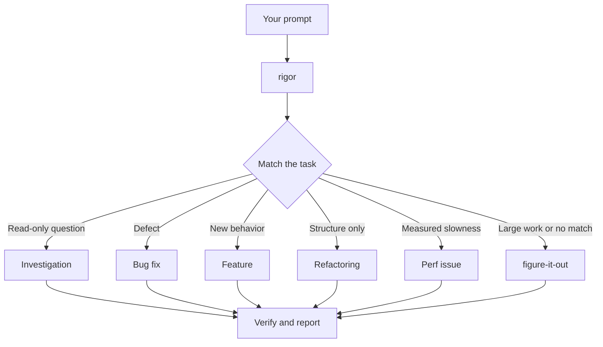

# Route work through `/rigor`

`/rigor` is the entry point. You give it a goal; it matches a playbook, copies the steps into the todo list, and calls other skills as the steps need them.



These are the common routes. The full list, including hillclimbing a metric, runtime and trace forensics, prototypes, visual parity, skill authoring and evals, test audits, babysitting and shipping PRs, autopilot queues, orchestration, session pickup, and worktree cleanup, is in [the rigor skill](../../skills/rigor/SKILL.md#start-a-task).

## Say the goal, not the process

State what's wrong or what you want, plus anything you already know:

```text
/rigor users get two notifications after a retry. repro first, then fix and verify.
```

"repro first" is a real constraint and the Bug fix playbook honors it. When the conversation already has the context, the prompt can be almost nothing: `do it`, `continue`, `keep going until done`. The playbook holds the structure; your words carry the intent.

## Switch tasks explicitly

A long session carries context from the previous task. When you change subjects, say so:

```text
/rigor new task. figure out why the cache entry survives logout. don't change any code yet.
```

"new task" makes `/rigor` pick a playbook again instead of continuing the old one. "don't change any code yet" pins it to Investigation. Without them, a session in the middle of a feature tends to treat your question as the next feature step.

## One worktree per parallel task

Several agents in one working tree overwrite each other's files. Ask for isolation:

```text
/rigor new task. branch off <base> in a fresh worktree, then port the parser change there.
```

The Opening a PR playbook already uses a worktree for code changes, so you mostly say this when a specific base matters. When worktrees pile up:

```text
/rigor what's eating my disk? prune the worktrees that are safe to prune.
```

The Worktree cleanup playbook classifies each worktree by merge state, uncommitted work, and recent use, deletes only what that clears, and asks you about anything with uncommitted work.

## Leave it running

```text
/rigor i'm stepping away. keep going until the migration check reports zero old callers. log your decisions.
```

A long run you'll review later goes to the Autonomous run playbook, which keeps a `/show-me-your-work` decision log; `/figure-it-out` is for large work no playbook fits. A small change (a few lines, obvious approach) skips the design and delegation steps, but still gets a runtime check, and a review unless it touches no code or the tests fully cover it. [Run work while you're away](./07-overnight.md) has the details.

**Pitfall:** don't list skills in your prompt ("use /how, then /architect, then /arena"). The playbook already orders them, and a hand-written sequence usually drops or reorders steps. Name a skill only to override a specific choice.

Next: [Understand the code](./03-understand.md).
