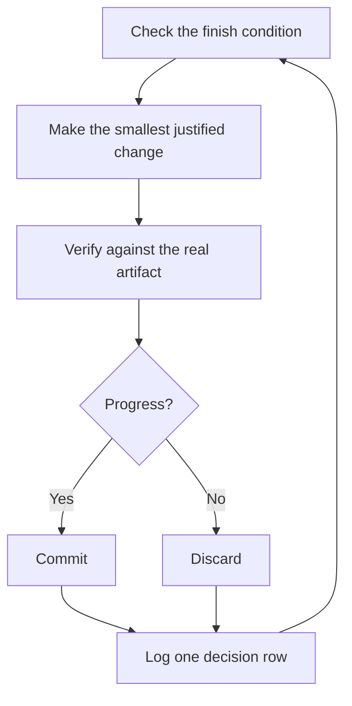

# Run work while you're away

An agent that verifies its own work can be left alone with a hard task. What makes that safe is a checkable finish condition, an isolated worktree, and a decision log you review afterwards.

## The handoff

A good handoff states the goal, the finish condition, permissions, and a way out:

```text
/rigor i'm going to bed. migrate every caller to the new parser in a fresh worktree off <base>.
done means zero old callers, all parser fixtures pass, old api deleted.
keep a decision log. don't ask me before committing.
loop until done. if you're truly stuck after a few hours, stop and write up why.
```

What each line does:

- "i'm going to bed" grants full autonomy: the agent stops checking in. It still pauses before irreversible actions such as force-pushing a shared branch or deploying.
- "done means..." turns the goal into checks each iteration can run.
- "fresh worktree off `<base>`" keeps the run away from anything else you have open.
- "don't ask me before committing" answers in advance the question the agent would otherwise wait on.
- "loop until done" routes to the Autonomous run playbook, which re-checks the finish condition on each iteration. In Claude Code you can drive it with `/loop`; in Codex, with `/goal`.
- The way out lets the agent stop at a real dead end and explain, instead of quietly redefining the goal.

Because you'll review the work later, `/rigor` routes it through [`/figure-it-out`](../../skills/figure-it-out/SKILL.md), which plans the phases and sets up the decision log.

## What each iteration does



One change, one check, one log row. Changes that didn't help are discarded. A plateau means trying a different approach, not stopping, and the finish condition never gets relaxed to declare success.

## Reviewing the run

[`/show-me-your-work`](../../skills/show-me-your-work/SKILL.md) keeps the log as a TSV (`decisions.tsv`, or `.audit/<task-slug>.tsv` when several runs share a directory) with time, phase, decision, reason, evidence pointer, and result per row. It stays local unless the work needs an auditable record in the repo.

```text
/show-me-your-work catch me up on what you did last night
```

Before summarizing, it has a reviewer on a different model read the log and transcript. The reply ends with an Attention section listing what deserves your scrutiny. Start there, then read the log rows it points to.

## Queues and programs

Three playbooks scale the same approach past one task.

**Autopilot (full)** takes a queue of independent PRs to merged. Each PR has one owner agent; fresh verifiers check the patch at code-ready and after every later push that changes it, and only a clean verdict on the exact patch being merged allows the merge.

```text
/rigor full autopilot on this queue. each item is independent. i want them merged by morning.
```

**Autopilot (stack)** runs the same loop but merges nothing. You get one linear stack with a verifier's verdict on each PR, and you land it. Use it when the changes are coupled or you want to review before anything merges.

```text
/rigor autopilot these five changes but stack them, don't ship. i'll land the stack in the morning.
```

**Orchestrate** is for multi-day programs with many stacked PRs and many subagents under one coordinator session. The coordinator writes briefs, collects results, keeps the lowest unmerged PR green, and doesn't write code itself. If one agent could finish the work in a session, the playbook sends you back to the handoff above.

```text
/rigor orchestrate the store migration. own it until every package is converted and merged. i'll check in twice a day.
```

**Pitfall:** a duration isn't a finish condition. "work on this for 4 hours" gives the agent nothing to check. Give it something that can pass or fail.

Next: [Steer with principle names](./08-principles.md).
